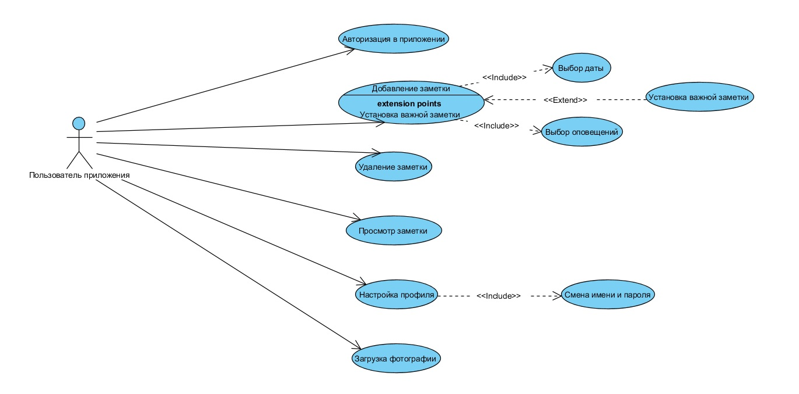

# Диаграмма вариантов использования

Сценарии для каждого варианта использования описаны в [потоке событий](../UseCase/Поток_событий.md).

Ключевые понятия, используемые в диаграмме вариантов использования, отражены в [глоссарии](../UseCase/). 
